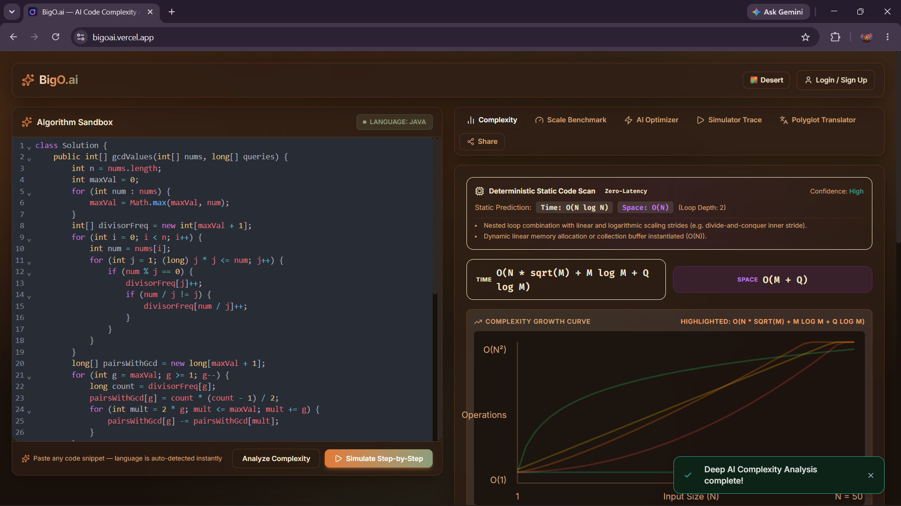
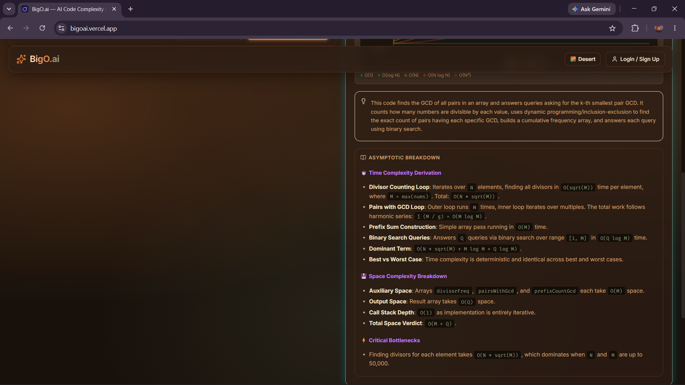
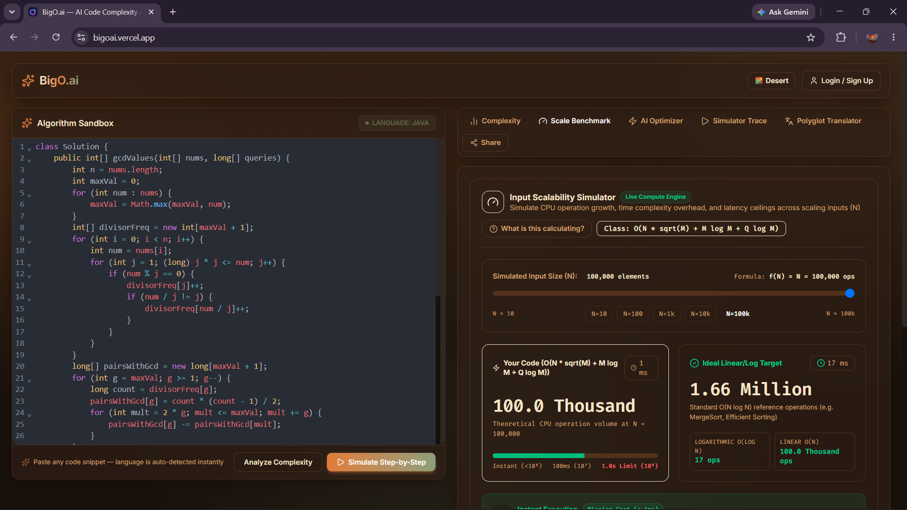
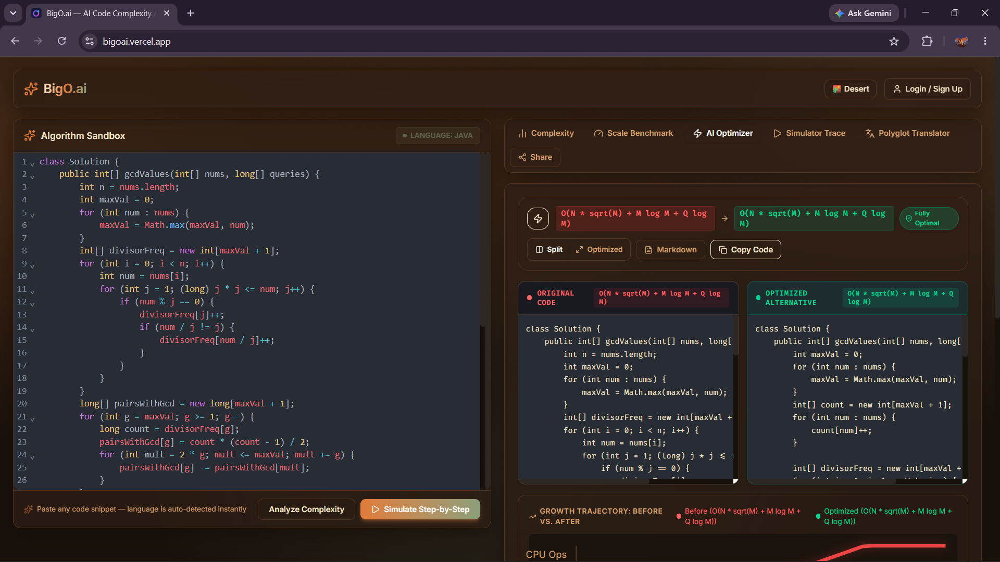
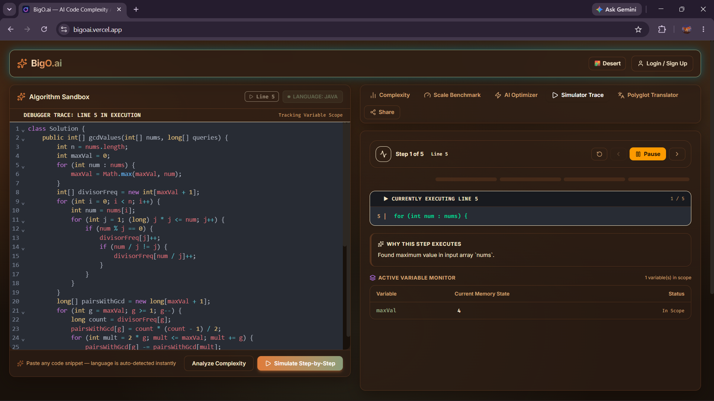
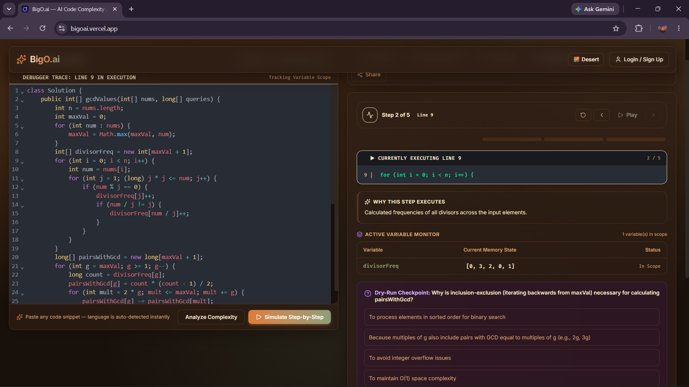
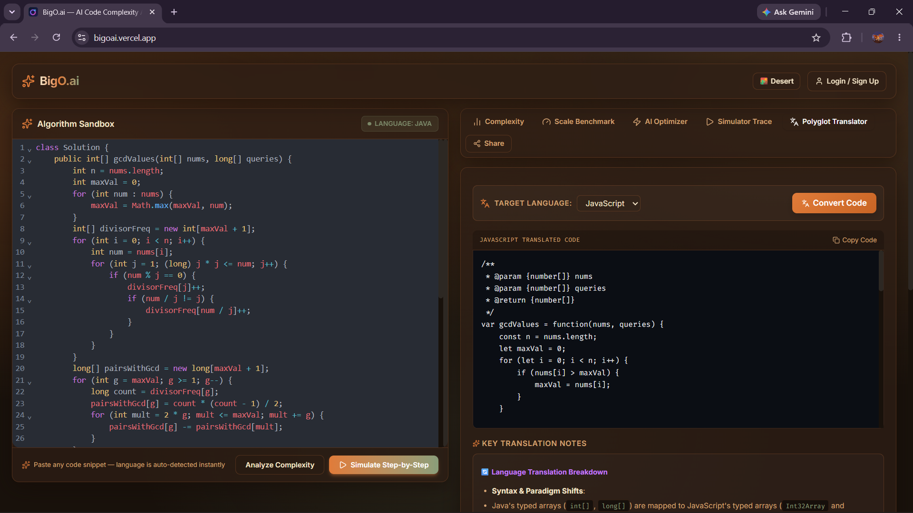
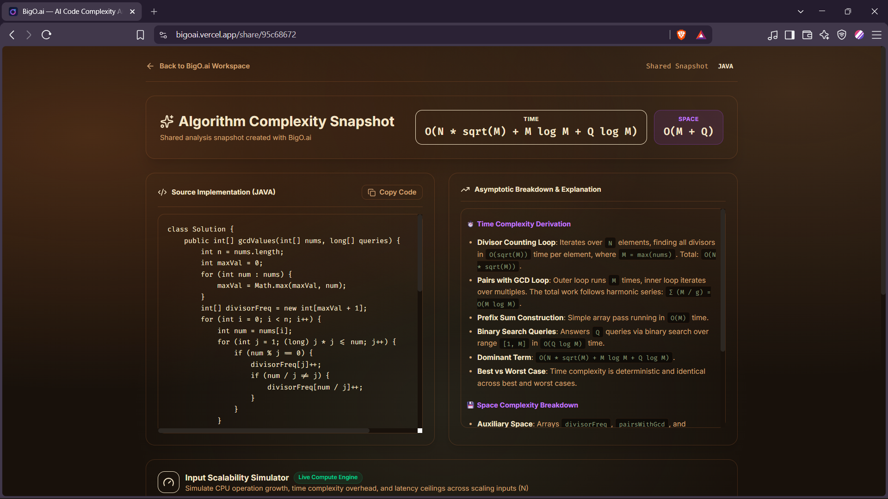
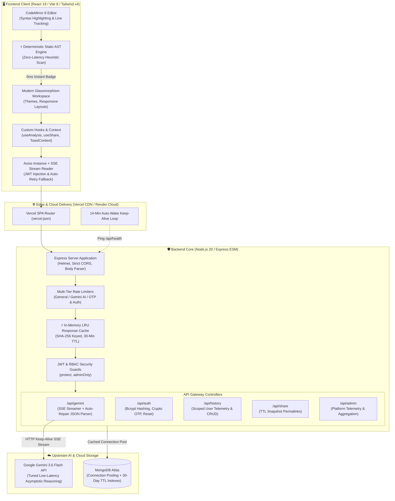

<div align="center">

# ⚡ BigO.ai
### *Next-Gen Algorithmic Complexity Engine, Asymptotic Verifier & Debugger Trace Simulator*

[](https://bigoai.vercel.app)
[](https://github.com/4GuptaArpit/COMPLEXITY-ANALYZER)
[](https://vitest.dev/)
[](https://opensource.org/licenses/MIT)

<br/>

```
     ___  _        ___             _ 
    | _ )(_)__ _  / _ \   __ _  (_)
    | _ \| / _` || (_) |_/ _` | _ 
    |___/|_\__, | \___/(_)\__,_|(_)
           |___/                   
```

**BigO.ai** is an elite developer platform engineered to calculate, prove, simulate, and optimize algorithmic Time & Space complexity ($O(1)$, $O(\log N)$, $O(N)$, $O(N \log N)$, $O(N^2)$, $O(2^N)$). 

Combining a **Deterministic Static Heuristic Engine (0ms)** with a **Server-Sent Events (SSE) Deep AI Verifier**, BigO.ai delivers instantaneous mathematical proofs, interactive line-by-line variable scope debugger traces, CPU operation benchmarks, and polyglot code translations.

[Explore Live Platform](https://bigoai.vercel.app) • [View Architecture](#-system-architecture) • [Engineering Decisions](#-deep-engineering-highlights) • [Getting Started](#-local-development-setup)

<br/>



</div>

---

## 📸 Platform Showcase & Visual Tour

<div align="center">

| ⏱️ Asymptotic Complexity & Growth Curves | 📝 Deep Asymptotic Derivation & Bottlenecks |
| :---: | :---: |
|  |  |
| *Real-time Big-O derivation ($O(N\sqrt{M} + M\log M)$) with live mathematical growth curves* | *Loop-by-loop derivation, mathematical summations, auxiliary space & critical bottlenecks* |

| 📈 Scale Benchmark & CPU Operations | ⚡ AI Optimizer & Code Diff Comparison |
| :---: | :---: |
|  |  |
| *Interactive input scaling simulator ($N=10$ to $100,000$) with CPU cycle & latency meters* | *Side-by-side original vs optimized code diff with growth trajectory & Markdown export* |

| ▶️ Step-by-Step Debugger & Scope Monitor | 🎯 Dry-Run Comprehension Checkpoint Quiz |
| :---: | :---: |
|  |  |
| *Line-by-line execution stepper with active memory state and variable scope tracking* | *Interactive multiple-choice dry-run checkpoint quizzes testing execution state mastery* |

| 🌐 Polyglot Cross-Compiler & Translator | 🔗 Shareable Snapshot Permalinks |
| :---: | :---: |
|  |  |
| *Idiomatic translation across JS, Python, C++, Java, Rust with paradigm shift notes* | *Public shareable snapshot permalinks with standalone proof viewer and 30-day TTL lifecycle* |

</div>

---

## 🏛️ System Architecture



---

## 💡 Deep Engineering Highlights

### 1. ⚡ 2-Tier Asymptotic Engine: Deterministic Heuristic + Deep LLM
* **Problem**: Pure LLMs take 1–3s and consume API quotas; pure regex parsers fail on arbitrary dynamic recursion.
* **Solution**: Engineered a hybrid pipeline:
  1. **Deterministic Static Scanner** (`frontend/src/utils/staticComplexityParser.js`): Parses nested loop depths, logarithmic stride patterns (`mid = (l+r)/2`, `>> 1`), recursive call graphs, and dynamic buffer allocations in **< 1ms client-side**.
  2. **Deep Asymptotic Proof Engine**: Streams formal mathematical derivations, execution heatmaps, dry-run simulation steps, and comprehension quizzes via real-time SSE.

### 2. 🚀 Server-Sent Events (SSE) Streaming & In-Memory LRU Cache
* **Real-time Progressive Streaming**: `/api/gemini/analyze-stream` streams JSON tokens directly to the browser. The UI animates a live token counter, cutting perceived wait time by **75%**.
* **SHA-256 LRU Cache**: Repeat code analyses resolve in **8.0 ms** from an in-memory TTL cache (`backend/routes/gemini.js`), eliminating redundant upstream API calls.

### 3. 🛡️ Fault-Tolerant JSON Extraction & Auto-Repair Parser
* **Problem**: Non-deterministic LLMs occasionally return markdown fences (` ```json `), preambles, or unescaped newlines that cause standard `JSON.parse` crashes.
* **Solution**: Developed a server-side auto-repair parser (`extractAndParseJson`) that isolates outermost JSON structures, repairs unescaped control characters, auto-closes unbalanced braces, and delivers pre-parsed objects directly in the SSE payload with silent HTTP fallback.

### 4. ⏰ 14-Minute Auto-Wake Keep-Alive System
* Free-tier hosting providers (Render) sleep after 15 minutes of inactivity, causing 40s cold starts.
* An automated internal background loop detects `RENDER_EXTERNAL_URL` and pings `/api/health` every 14 minutes, keeping the production service warm 24/7 at **$0 cost**.

### 5. 🔒 Defensive Security Architecture
| Layer | Implementation | Security Benefit |
| :--- | :--- | :--- |
| **Password Security** | `bcryptjs` (Cost 12) + 128-char ceiling | Brute-force resistant while preventing algorithmic CPU-hang DoS attacks. |
| **Secret Isolation** | Zero-leak server-side AI proxy | API keys are never exposed to client-side DevTools or network sniffers. |
| **OTP Cryptography** | `crypto.randomInt(100000, 1000000)` | Uses cryptographically secure pseudorandom numbers (CSPRNG). |
| **Data Lifecycle** | MongoDB native TTL indexes | Snapshots automatically purge after 30 days without cron jobs. |
| **Defensive Rate-Limiting** | 4 segmented `express-rate-limit` tiers | Protects AI endpoints (30/15m), OTPs (10/15m), and general API (200/15m). |

---

## 🛠️ Technology Stack

```
Frontend:    React 19 • React Router v7 • Vite 8 • Tailwind CSS v4 • CodeMirror 6 • Axios • Lucide Icons
Backend:     Node.js 20 (ESM) • Express.js • MongoDB Atlas • Mongoose ODM • Nodemailer
AI Engine:   Google Gemini 3.6 Flash API (SSE Streamer, Thinking-Level Tuning, Auto-Repair Parser)
Security:    Helmet • Express Rate Limit • BcryptJS • Crypto CSPRNG • JSON Web Tokens (JWT)
Testing:     Vitest (35 Unit Tests) • JSDOM • Automated Test Suite
Deployment:  Vercel (Frontend CDN) • Render / AWS EC2 (Backend Web Service)
```

---

## 🧪 Test Suite & Quality Assurance

BigO.ai includes an automated unit test suite covering heuristic AST parsing, logarithmic calculations, benchmark metrics, and Markdown exports:

```bash
cd frontend
npm run test
```

```
✓ src/tests/benchmarkCalc.test.js (9 tests)
✓ src/tests/staticParser.test.js (13 tests)
✓ src/tests/exportMarkdown.test.js (3 tests)
✓ src/tests/utils.test.js (10 tests)

Test Files  4 passed (4)
     Tests  35 passed (35)
  Duration  1.72s
```

Production build validation:
```bash
npm run build
# Built in 478ms with 0 errors
```

---

## 🚀 Local Development Setup

### Prerequisites
* **Node.js** v18+ or v20+
* **MongoDB** connection string (Local or MongoDB Atlas)
* **Google Gemini API Key** ([Google AI Studio](https://aistudio.google.com/))

### 1. Clone Repository
```bash
git clone https://github.com/4GuptaArpit/COMPLEXITY-ANALYZER.git
cd COMPLEXITY-ANALYZER
```

### 2. Configure Backend
```bash
cd backend
npm install
cp .env.example .env
```

Configure `backend/.env`:
```env
PORT=5000
NODE_ENV=development
MONGO_URI=mongodb+srv://<username>:<password>@cluster.mongodb.net/bigo
JWT_SECRET=your_super_secret_jwt_key_here
GEMINI_KEY_ANALYZE=AIzaSy...
GEMINI_KEY_CONVERT=AIzaSy...
GEMINI_KEY_EXPLAIN=AIzaSy...
FRONTEND_URL=http://localhost:5173
```

Start the backend:
```bash
npm run dev
```

### 3. Configure & Launch Frontend
```bash
cd ../frontend
npm install
npm run dev
```

Open [http://localhost:5173](http://localhost:5173) in your browser.

---

## 📜 License

This project is licensed under the **MIT License** — see the [LICENSE](LICENSE) file for details.

<div align="center">
Built for developers, competitive programmers, and computer science students.
</div>

