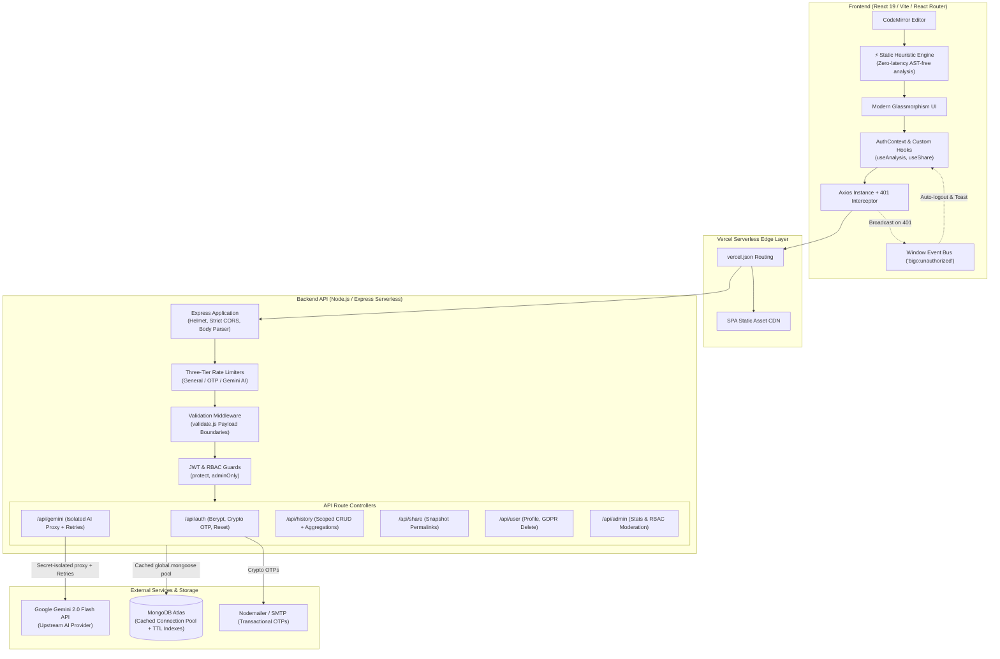

# BigO.ai — Hybrid Algorithm Complexity Engine & Execution Visualizer

[](https://github.com/4GuptaArpit/COMPLEXITY-ANALYZER/actions)
[](https://vitest.dev/)
[](https://react.dev/)
[](https://vitejs.dev/)
[](https://nodejs.org/)
[](https://expressjs.com/)
[](https://www.mongodb.com/)
[](https://opensource.org/licenses/MIT)

**BigO.ai** is a full-stack algorithmic performance engine engineered to calculate, optimize, and simulate asymptotic time and space complexity ($O(N)$, $O(\log N)$, $O(N^2)$, etc.). Featuring a **Dual-Engine Architecture** — blending a zero-latency deterministic static code parser with an isolated Google Gemini AI deep-simulation proxy — BigO.ai provides instant heuristic estimates, interactive variable dry-run execution traces, $N$-scale CPU operation benchmarks, and polyglot code translations.

---

## 🏛️ System Architecture



---

## 💡 Key Engineering Decisions & Scalability

### 1. ⚡ Dual-Engine Complexity Architecture (Static Heuristic + Deep LLM)
* **Problem**: Relying solely on remote LLMs introduces network latency (1–2s), API rate limit risks, and cloud compute cost. Conversely, pure rule-based parsers fail on complex recursion or arbitrary dynamic code.
* **Solution**: Implemented a two-tier analysis pipeline:
  1. **Deterministic Static Engine** (`frontend/src/utils/staticComplexityParser.js`): Evaluates loop nesting hierarchies, binary logarithmic strides (`mid = (l+r)/2`, `>> 1`), recursive call graphs, and dynamic allocation vectors client-side in `< 1ms`.
  2. **Deep Simulation Proxy**: Generates step-by-step variable traces, interactive quizzes, and semantic code optimizations upon user request.

### 2. 🛡️ Zero-Leak API Proxy Architecture
* **Problem**: Calling LLM APIs directly from client-side code exposes private API keys via browser DevTools/Network inspection and allows unauthorized key hijacking.
* **Solution**: Client applications never interact directly with Google Gemini. All requests flow through a protected serverless proxy endpoint (`/api/gemini/analyze`, `/api/gemini/convert`, `/api/gemini/explain`).
* **Resilience**: Features exponential backoff retry handling (3 attempts with jitter) to gracefully manage upstream HTTP `429 Too Many Requests` status codes.

### 3. ⚡ Serverless Connection Pooling (`global.mongoose`)
* **Problem**: In serverless environments (e.g., Vercel / AWS Lambda), every invocation can spin up isolated container runtimes, quickly exhausting MongoDB Atlas connection pools.
* **Solution**: Implemented a global cached connection singleton pattern (`backend/config/db.js`):
  ```javascript
  let cached = global.mongoose || (global.mongoose = { conn: null, promise: null });
  ```
  This guarantees that hot serverless instances reuse existing database connections across invocations, eliminating connection spikes and reducing cold-start latency.

### 4. ⏱️ Automated Data Lifecycle via Database TTL Indexes
* **Problem**: Shared code permalinks (`/share/:id`) can grow unboundedly over time, requiring expensive scheduled cron cleanup jobs or causing unnecessary database storage costs.
* **Solution**: Leveraged native MongoDB TTL (Time-To-Live) collection indexing:
  ```javascript
  shareSchema.index({ createdAt: 1 }, { expireAfterSeconds: 30 * 24 * 60 * 60 });
  ```
  Snapshots automatically expire and purge after 30 days at the database engine level with zero application overhead.

### 5. 🚦 Three-Tier Defensive Rate Limiting
* **Problem**: A single generic rate limiter either overly restricts standard page navigation or leaves expensive AI/OTP endpoints open to brute-force attacks.
* **Solution**: Segmented express-rate-limit instances based on risk surface:
  * **General API**: `200 req / 15 min` per IP (smooth UI transitions).
  * **AI Proxy Endpoints**: `30 req / 15 min` per IP (prevents token exhaustion & quota abuse).
  * **OTP & Password Recovery**: `10 req / 15 min` per IP (mitigates brute-force attacks).
  * **Feedback Submissions**: `10 req / 1 hour` per IP (prevents spam).

### 6. 📊 MongoDB Aggregation Pipelines for Telemetry
* **Endpoint**: `GET /api/admin/stats` & `GET /api/history/leaderboard`
* **Implementation**: Uses multi-stage aggregation (`$group`, `$sort`, `$limit`, and date range matching) across millions of documents to compute language adoption share, time complexity distributions, and platform usage velocity in real time.

### 7. 🔄 Decoupled Session Synchronization via Event Bus
* **Problem**: Handling JWT expiration inside deeply nested React components typically requires prop drilling, tight coupling, or redundant global state dispatches.
* **Solution**: An Axios response interceptor catches `401 Unauthorized` responses and emits a custom DOM event `bigo:unauthorized`. `AuthContext` listens globally to purge stale localStorage tokens and gracefully notify users via toast without component re-rendering cycles.

---

## 🔐 Security & Defensive Design

| Security Layer | Implementation Detail | Rationale |
|---|---|---|
| **Password Hashing** | `bcryptjs` with cost factor `12` | Resistant to GPU-accelerated hash cracking while maintaining sub-second user login times. |
| **Bcrypt DoS Protection** | Max length constraint (128 chars) | Prevents algorithmic complexity attacks where malicious clients send mega-sized password payloads to hang CPU threads. |
| **OTP Cryptography** | `crypto.randomInt(100000, 1000000)` | Uses cryptographically secure pseudorandom numbers (CSPRNG) instead of insecure `Math.random()`. |
| **Anti-Enumeration** | Identical response on forgot-password | Does not reveal whether an email address exists in the database. |
| **IDOR Prevention** | Explicit `userId` authorization matching | History record deletion enforces `History.findOne({ _id, userId: req.user._id })`. |
| **HTTP Hardening** | `helmet` + Strict CORS allowlist | Sets secure HTTP response headers (`X-Frame-Options`, `CSP`, `HSTS`) and denies unauthorized cross-origin requests. |
| **Payload Bounding** | Hardcoded character ceilings | Input validation restricts code sizes (50k for AI, 100k for DB), blocking storage-exhaustion vectors. |

---

## ✨ Features & Capabilities

* **⚡ Instant Static Heuristic Scan**: Zero-latency, deterministic parsing of loop depth, logarithmic strides, and recursive branching.
* **⏱️ Dynamic Complexity Detection**: AI-verified asymptotic bounds with interactive SVG growth curves ($O(1)$, $O(\log N)$, $O(N)$, $O(N \log N)$, $O(N^2)$, $O(2^N)$).
* **🎛️ Input Scalability Simulator**: Interactive $N$-value benchmark slider ($N = 10$ to $100,000$) estimating CPU cycle volume and latency comparisons against ideal linear/log targets.
* **▶️ Step-by-Step Code Execution Trace**: Line-by-line variable state inspection with interactive dry-run comprehension quizzes.
* **⚡ AI Optimizer & Markdown Generator**: Generates refactored alternative code alongside a one-click formatted Markdown export suitable for Notion, GitHub READMEs, and technical docs.
* **🌐 Polyglot Cross-Compiler**: Converts algorithms across JavaScript, Python, C++, Java, and Rust with detailed language idiom explanations.
* **🔗 Shareable Permalinks**: Creates permalink snapshot URLs (`/share/:id`) with standalone viewer pages.
* **🛡️ RBAC Admin Management**: Comprehensive administrative portal with aggregate telemetry, user management, and feedback moderation.

---

## 🛠️ Technology Stack

```
Frontend:   React 19 • React Router v7 • Vite 8 • Tailwind CSS v4 • CodeMirror • Axios • Lucide Icons
Backend:    Node.js (ESM) • Express.js • MongoDB Atlas • Mongoose ODM • Nodemailer
Security:   Helmet • Express Rate Limit • BcryptJS • Crypto CSPRNG • JSON Web Tokens (JWT)
AI Engine:  Google Gemini 2.0 Flash API (Server-Side Proxy with Jitter Retries)
CI/CD:      GitHub Actions • Automated Vitest Runner • Production Build Validator
Testing:    Vitest (35 Unit Tests) • JSDOM
```

---

## 🧪 Testing & Verification

The project includes an automated test suite verifying static parsing algorithms, mathematical benchmark models, Markdown report generation, and polyglot detection:

```bash
cd frontend
npm run test
```

```
✓ src/tests/benchmarkCalc.test.js (9 tests)
✓ src/tests/staticParser.test.js (13 tests)
✓ src/tests/exportMarkdown.test.js (3 tests)
✓ src/tests/utils.test.js (10 tests)

Test Files  4 passed (4)
     Tests  35 passed (35)
```

Execute production bundle build check:
```bash
cd frontend
npm run build
```

---

## 🚀 Getting Started Locally

### Prerequisites
* **Node.js** v18+
* **MongoDB** connection string (Local or MongoDB Atlas)
* **Google Gemini API Key** ([Google AI Studio](https://aistudio.google.com/))

### 1. Clone & Configure Backend
```bash
cd backend
npm install
cp .env.example .env
```

Edit `backend/.env`:
```env
PORT=5000
NODE_ENV=development
MONGO_URI=mongodb+srv://<username>:<password>@cluster.mongodb.net/bigodb
JWT_SECRET=your_super_secret_jwt_key_here
GEMINI_API_KEY=AIzaSy...
FRONTEND_URL=http://localhost:5173
EMAIL_USER=your_email@gmail.com
EMAIL_PASS=your_gmail_app_password
ADMIN_EMAIL=admin@yourdomain.com
```

Start the backend:
```bash
npm run dev
```

### 2. Configure & Run Frontend
```bash
cd ../frontend
npm install
npm run dev
```
Open [http://localhost:5173](http://localhost:5173) in your browser.

---

## ⚖️ Engineering Trade-Offs

| Decision | Alternative Considered | Why This Choice Was Made |
|---|---|---|
| **Dual-Engine Architecture** | Pure LLM Inference | Eliminates API cold starts and quota depletion for instant feedback while preserving deep reasoning for complex traces. |
| **Vercel Serverless Functions** | Long-running Node/Express Docker container on AWS EC2/ECS | Near-zero operational maintenance, automatic scaling with traffic spikes, and integrated edge asset caching for a portfolio/production deployment. |
| **MongoDB TTL Index** | Redis key expiration / Scheduled node-cron jobs | Eliminates the need for a separate memory store or background worker process; database manages cleanup natively. |
| **Custom Event Bus on 401** | Global Redux state / Context re-renders | Decouples HTTP interceptor logic from the React component tree, preventing re-render thrashing when handling expired credentials. |
| **Server-side AI Proxying** | Direct client SDK calls | Essential for secret isolation. Trading 20ms network transit for absolute API key protection is a non-negotiable security requirement. |

---

## 📝 Resume Bullet Suggestions

Here is how you can present this project on your resume for maximum recruiter impact:

* **BigO.ai — Full-Stack Algorithmic Complexity & Execution Engine** *(React 19, Node.js, Express, MongoDB, Google Gemini, Vitest)*
  * Engineered a dual-engine algorithm complexity platform with a zero-latency client-side static heuristic parser and an isolated server-side LLM proxy with exponential backoff retries.
  * Architected serverless MongoDB connection pooling via global singleton caching, mitigating cold starts and connection pool exhaustion on edge environments.
  * Implemented defensive security boundaries including 3-tier risk-segmented rate limiting, CSPRNG OTP generation, IDOR-protected scoped queries, and 30-day automated TTL data pruning.
  * Developed a comprehensive 35-test unit suite in Vitest integrated into a GitHub Actions CI/CD pipeline ensuring 100% build and regression integrity.

---

## 📜 License

Distributed under the MIT License. Built with attention to performance, security, and developer ergonomics.
